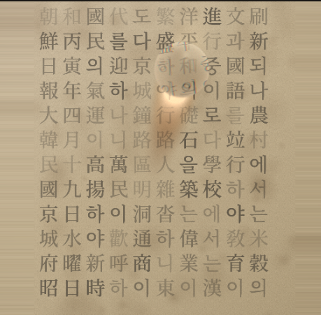

# 김창열 물방울 — 신문 위 WebGL 인터랙션

## 라이브 체험 (먼저 눌러 보세요)

### **https://jhunj.github.io/kimchang/**

위 주소에서 **설치 없이** 브라우저만으로 동작합니다. (모바일·PC)

[](https://jhunj.github.io/kimchang/)

[](https://github.com/JhunJ/kimchang/actions/workflows/deploy-pages.yml)
[](https://github.com/JhunJ/kimchang)

---

## 스크린샷 (최신 UI)



---

브라우저에서 **신문 질감 텍스트**를 배경으로 깔고, 그 위를 **WebGL**로 그린 **물방울**이 굴절·빛을 내는 인터랙티브 데모입니다. 한국 현대미술가 **김창열(Kim Tschang-yeul)** 작가의 물방울·신문 미학을 **참고한 비공식 웹 프로젝트**이며, 작가·미술관과 공식 협력 관계는 없습니다.

---

## 이 프로그램이 하는 일

- **신문·잡지 느낌의 본문**을 캔버스 뒤쪽 텍스처로 그립니다. (`@chenglou/pretext` 기반 단락/농담 배치)
- **물방울**은 셰이더에서 반구형으로 해석되며, 배경 글자가 **굴절**되어 보입니다.
- 물방울이 움직이면 **젖은 자국(wet trail)** 이 남도록 처리되어 있습니다.
- 정지에 가까울 때 아주 약한 **바람 느낌의 미세 흔들림**이 더해질 수 있습니다.
- 물방울 **개수를 늘리면** 이미 있던 방울의 위치는 유지되고, **겹치지 않게** 빈 곳에만 새 방울이 추가됩니다.

---

## 실행 방법

```bash
npm install
npm run dev           # 로컬 개발 (base: /)
npm run build         # dist (로컬·루트 배포용)
npm run build:pages   # GitHub Pages용 (/kimchang/ base)
npm run preview       # 빌드 미리보기
```

- **GitHub Pages**에 맞춘 빌드는 `npm run build:pages` 또는 CI와 동일하게 `VITE_BASE_PATH=/kimchang/ npm run build` 입니다.
- 배포는 `.github/workflows/deploy-pages.yml` 이 `main` 푸시 시 **자동**으로 `dist`를 게시합니다.

---

## 화면 구성

| 영역 | 설명 |
|------|------|
| **위쪽 큰 캔버스** | 물방울이 올라간 WebGL 화면. 여기서 드래그·탭으로 조작합니다. |
| **아래 편집 패널** | 신문 본문, 글자 크기, 물방울 크기·개수 슬라이더 |
| **페이지 하단 안내** (웹앱 내) | 상세 설명, 김창열 소개, 링크, **실행 환경 점검** 버튼 |

설정(본문·슬라이더 값)은 브라우저 **localStorage**에 저장됩니다.

---

## 조작 요약 (경우별)

### 물방울 1개

- **누른 채 드래그**: 물방울 목표가 포인터를 따라갑니다.
- 짧게 **클릭**해도 해당 위치로 이동합니다.

### 물방울 2개 이상

- **방울을 탭**: 그 방울이 선택되며 가장자리가 은은하게 강조됩니다.
- **같은 방울을 다시 탭**: 강조가 꺼지고, 모든 방울이 같은 기본 톤으로 보입니다.
- **선택된 상태에서 빈 화면 탭**: **선택된 방울만** 그 위치로 이동합니다. (선택이 없으면 빈 곳 탭만으로는 이동하지 않습니다.)
- **다른 방울 탭**: 선택이 그쪽으로 바뀝니다.

슬라이더 줄에서 **마우스 휠**로도 글자 크기·물방울 크기·개수를 조절할 수 있습니다.

---

## 김창열 아트와의 관계

**김창열**(영문 표기로는 **Kim Tschang-yeul** 등)은 1970년대부터 **물방울**을 정교하게 그리며 국제적으로 알려진 **한국계 현대미술가**(1929–2021)입니다. 신문·한자·서예 등 **텍스트가 있는 바탕** 위에 맑은 물방울을 올린 작업은 그의 대표적인 화풍으로 널리 알려져 있습니다.

이 저장소의 웹 데모는 그런 **시각적 연상**을 디지털로 실험한 것이며, 실제 회화의 재질·스케일·붓터치를 재현하는 것이 목적은 아닙니다.

### 관련 링크

- [한국어 위키백과 — 김창열 (화가)](https://ko.wikipedia.org/wiki/%EA%B9%80%EC%B0%BD%EC%97%B4_(%ED%99%94%EA%B0%80))
- [English Wikipedia — Kim Tschang-yeul](https://en.wikipedia.org/wiki/Kim_Tschang-yeul)
- [김창열 미술관 (제주) 공식 사이트](https://kimtschang-yeul.jeju.go.kr/)
- [국립현대미술관 MMCA](https://www.mmca.go.kr/) (현대미술 소장·전시 검색에 활용)

---

## 기술 스택

- **TypeScript**, **Vite**
- **WebGL** (커스텀 버텍스/프래그먼트 셰이더)
- **@chenglou/pretext** — 본문 레이아웃

---

## GitHub에서 검색·노출·Social preview

- 저장소 **About → Description** 에 **라이브 체험 전체 URL**(`https://jhunj.github.io/kimchang/`)이 들어가 있도록 해 두었습니다. (웹앱 화면 안이 아니라 **깃허브 저장소 설명란**용입니다.)
- **Website** 필드에도 동일한 주소가 연결되어 있습니다.
- **Settings → General → Social preview** 에 `public/docs/screenshot.png` 를 올리면 링크 카드에 썸네일이 붙습니다.

---

## 라이선스

별도 라이선스 파일이 없습니다. 필요하면 저장소에 `LICENSE`를 추가하세요.

---

# English

## Live demo (try it first)

### **https://jhunj.github.io/kimchang/**

Runs **in the browser** with no install. (Mobile and desktop.)

[](https://jhunj.github.io/kimchang/)

[](https://github.com/JhunJ/kimchang/actions/workflows/deploy-pages.yml)
[](https://github.com/JhunJ/kimchang)

---

## Screenshot (latest UI)


---

An interactive **WebGL** demo of **water droplets** on **newsprint-like text**, with refraction and highlights. It is an **unofficial** web experiment inspired by the water-on-newspaper aesthetic of Korean modern artist **Kim Tschang-yeul** (1929–2021). It is **not** an official collaboration with the artist or museums.

---

## What it does

- Renders **magazine/newspaper-style body text** as the background texture (paragraph layout via `@chenglou/pretext`).
- **Droplets** are shaded as hemispherical lenses; the text **refracts** underneath.
- Moving droplets leave a subtle **wet trail**.
- Near rest, a very light **wind-like jitter** may appear.
- Increasing the **droplet count** keeps **existing** droplets in place and adds new ones only in **empty** space (no overlap).

---

## How to run

```bash
npm install
npm run dev           # local dev (base: /)
npm run build         # dist (local / root deploy)
npm run build:pages   # GitHub Pages (/kimchang/ base)
npm run preview       # preview build
```

- For **GitHub Pages**, use `npm run build:pages` or `VITE_BASE_PATH=/kimchang/ npm run build`, same as CI.
- **Deploy**: `.github/workflows/deploy-pages.yml` publishes `dist` on pushes to `main`.

---

## UI layout

| Area | Description |
|------|-------------|
| **Large canvas (top)** | WebGL view. Drag and tap here. |
| **Panel below** | Newspaper text, font size, droplet size & count sliders |
| **Details at bottom** (in the app) | Longer copy, artist note, links, **environment check** button |

Settings (text and sliders) are saved in **localStorage**.

The web app also offers **KO / EN** in the top bar (stored in the browser).

---

## Controls (by case)

### One droplet

- **Drag** with pointer down: the droplet follows.
- Short **click/tap** also moves it to that spot.

### Two or more droplets

- **Tap a droplet**: it becomes selected (subtle highlight).
- **Tap the same droplet again**: clears selection.
- **With a selection, tap empty space**: **only the selected** droplet moves. (With no selection, tapping empty space does nothing.)
- **Tap another droplet**: selection moves there.

You can also use the **mouse wheel** on the slider rows (desktop) to tweak font size, droplet size, and count.

---

## Relationship to Kim Tschang-yeul’s art

**Kim Tschang-yeul** (Hangul: 김창열; Hanja: 金昌烈) is widely known for meticulous **water droplets** on grounds that often include **newsprint, Hanja, and calligraphy**. This repository is a **digital homage**—it does not try to reproduce physical paint, scale, or brushwork.

### Links

- [Korean Wikipedia — 김창열 (Kim Tschang-yeul)](https://ko.wikipedia.org/wiki/%EA%B9%80%EC%B0%BD%EC%97%B4_(%ED%99%94%EA%B0%80))
- [English Wikipedia — Kim Tschang-yeul](https://en.wikipedia.org/wiki/Kim_Tschang-yeul)
- [Kim Tschang-yeul Art Museum (Jeju)](https://kimtschang-yeul.jeju.go.kr/)
- [National Museum of Modern and Contemporary Art (MMCA)](https://www.mmca.go.kr/) — useful for collection and exhibition search

---

## Tech stack

- **TypeScript**, **Vite**
- **WebGL** (custom vertex/fragment shaders)
- **@chenglou/pretext** — body text layout

---

## GitHub discovery & Social preview

- The repo **About → Description** includes the **full live URL** (`https://jhunj.github.io/kimchang/`) for discovery (not only inside the web app).
- The **Website** field points to the same URL.
- **Settings → General → Social preview**: upload `public/docs/screenshot.png` for link-card thumbnails.

---

## License

No `LICENSE` file is included yet; add one to the repo if you need an explicit terms.
