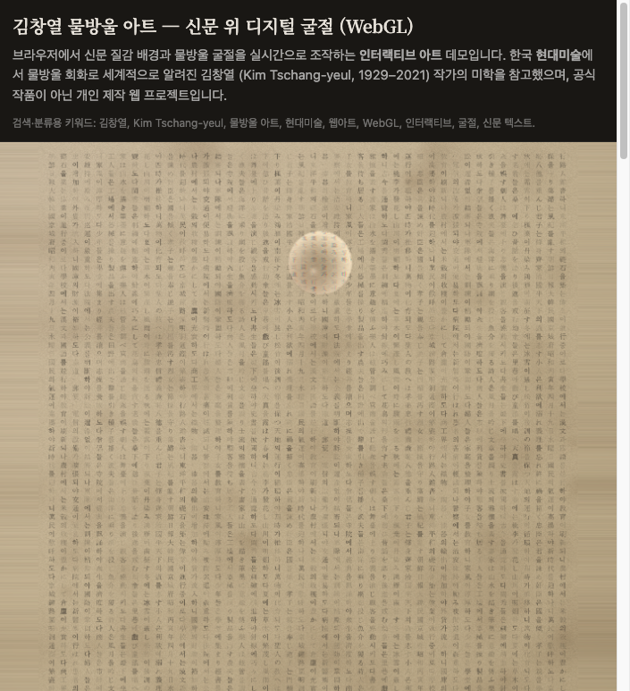

# 김창열 물방울 — 신문 위 WebGL 인터랙션

[](https://github.com/JhunJ/kimchang/actions/workflows/deploy-pages.yml)
[](https://jhunj.github.io/kimchang/)
[](https://github.com/JhunJ/kimchang)

브라우저에서 **신문 질감 텍스트**를 배경으로 깔고, 그 위를 **WebGL**로 그린 **물방울**이 굴절·빛을 내는 인터랙티브 데모입니다. 한국 현대미술가 **김창열(Kim Tschang-yeul)** 작가의 물방울·신문 미학을 **참고한 비공식 웹 프로젝트**이며, 작가·미술관과 공식 협력 관계는 없습니다.

| 항목 | 링크 |
|------|------|
| **라이브 체험 (GitHub Pages)** | **<https://jhunj.github.io/kimchang/>** |
| **소스 코드** | <https://github.com/JhunJ/kimchang> |

---

## 스크린샷

### 뷰포트 (헤더 + 캔버스)


### 전체 페이지 (안내 문서 포함)



---

## 이 프로그램이 하는 일

- **신문·잡지 느낌의 본문**을 캔버스 뒤쪽 텍스처로 그립니다. (`@chenglou/pretext` 기반 단락/농담 배치)
- **물방울**은 셰이더에서 반구형으로 해석되며, 배경 글자가 **굴절**되어 보입니다.
- 물방울이 움직이면 **젖은 자국(wet trail)** 이 남도록 처리되어 있습니다.
- 정지에 가까울 때 아주 약한 **바람 느낌의 미세 흔들림**이 더해질 수 있습니다.
- 물방울 **개수를 늘리면** 이미 있던 방울의 위치는 유지되고, **겹치지 않게** 빈 곳에만 새 방울이 추가됩니다.

---

## 실행 방법

```bash
npm install
npm run dev           # 로컬 개발 (base: /)
npm run build         # dist (로컬·루트 배포용)
npm run build:pages   # GitHub Pages용 (/kimchang/ base)
npm run preview       # 빌드 미리보기
```

- **GitHub Pages**에 맞춘 빌드는 `npm run build:pages` 또는 CI와 동일하게 `VITE_BASE_PATH=/kimchang/ npm run build` 입니다.
- 배포는 `.github/workflows/deploy-pages.yml` 이 `main` 푸시 시 **자동**으로 `dist`를 게시합니다.  
  처음 한 번은 저장소 **Settings → Pages → Build and deployment → Source: GitHub Actions** 로 두면 됩니다.

---

## 화면 구성

| 영역 | 설명 |
|------|------|
| **위쪽 큰 캔버스** | 물방울이 올라간 WebGL 화면. 여기서 드래그·탭으로 조작합니다. |
| **아래 편집 패널** | 신문 본문, 글자 크기, 물방울 크기·개수 슬라이더 |
| **페이지 하단 안내** (웹앱 내) | 상세 설명, 김창열 소개, 링크, **실행 환경 점검** 버튼 |

설정(본문·슬라이더 값)은 브라우저 **localStorage**에 저장됩니다.

---

## 조작 요약 (경우별)

### 물방울 1개

- **누른 채 드래그**: 물방울 목표가 포인터를 따라갑니다.
- 짧게 **클릭**해도 해당 위치로 이동합니다.

### 물방울 2개 이상

- **방울을 탭**: 그 방울이 선택되며 가장자리가 은은하게 강조됩니다.
- **같은 방울을 다시 탭**: 강조가 꺼지고, 모든 방울이 같은 기본 톤으로 보입니다.
- **선택된 상태에서 빈 화면 탭**: **선택된 방울만** 그 위치로 이동합니다. (선택이 없으면 빈 곳 탭만으로는 이동하지 않습니다.)
- **다른 방울 탭**: 선택이 그쪽으로 바뀝니다.

슬라이더 줄에서 **마우스 휠**로도 글자 크기·물방울 크기·개수를 조절할 수 있습니다.

---

## 김창열 아트와의 관계

**김창열**(영문 표기로는 **Kim Tschang-yeul** 등)은 1970년대부터 **물방울**을 정교하게 그리며 국제적으로 알려진 **한국계 현대미술가**(1929–2021)입니다. 신문·한자·서예 등 **텍스트가 있는 바탕** 위에 맑은 물방울을 올린 작업은 그의 대표적인 화풍으로 널리 알려져 있습니다.

이 저장소의 웹 데모는 그런 **시각적 연상**을 디지털로 실험한 것이며, 실제 회화의 재질·스케일·붓터치를 재현하는 것이 목적은 아닙니다.

### 관련 링크

- [한국어 위키백과 — 김창열 (화가)](https://ko.wikipedia.org/wiki/%EA%B9%80%EC%B0%BD%EC%97%B4_(%ED%99%94%EA%B0%80))
- [English Wikipedia — Kim Tschang-yeul](https://en.wikipedia.org/wiki/Kim_Tschang-yeul)
- [김창열 미술관 (제주) 공식 사이트](https://kimtschang-yeul.jeju.go.kr/)
- [국립현대미술관 MMCA](https://www.mmca.go.kr/) (현대미술 소장·전시 검색에 활용)

---

## 기술 스택

- **TypeScript**, **Vite**
- **WebGL** (커스텀 버텍스/프래그먼트 셰이더)
- **@chenglou/pretext** — 본문 레이아웃

---

## GitHub에서 검색·노출·체험 설정 (권장)

아래는 저장소가 **검색(GitHub 내부·외부)·프로필 핀**에 잘 잡히도록 하기 위한 체크리스트입니다.

### 1. 저장소가 공개(Public)인지

**Settings → General → Danger Zone → Change repository visibility** 에서 **Public** 이어야 GitHub 검색과 Pages가 넓게 노출됩니다. (이 저장소는 공개로 두는 것을 권장합니다.)

### 2. About (설명·Topics·웹사이트)

저장소 메인 화면 오른쪽 위 **⚙ About** 에서:

| 항목 | 예시 |
|------|------|
| **Description** | `신문 위 WebGL 물방울 굴절 · 김창열(Kim Tschang-yeul) 미학 참고 데모 · 라이브` |
| **Website** | `https://jhunj.github.io/kimchang/` |
| **Topics** | `webgl`, `typescript`, `vite`, `kim-tschang-yeul`, `kim-chang-yeul`, `contemporary-art`, `korean-art`, `interactive-art`, `water-droplet`, `digital-art`, `newspaper`, `refraction` |

CLI로 한 번에 반영하려면 (로그인된 `gh`):

```bash
gh repo edit JhunJ/kimchang \
  --description "신문 위 WebGL 물방울 굴절 데모 · 김창열(Kim Tschang-yeul) 미학 참고 · 라이브: jhunj.github.io/kimchang" \
  --homepage "https://jhunj.github.io/kimchang/" \
  --add-topic webgl --add-topic typescript --add-topic vite \
  --add-topic kim-tschang-yeul --add-topic contemporary-art --add-topic korean-art \
  --add-topic interactive-art --add-topic water-droplet --add-topic digital-art
```

### 3. Social preview (링크 공유 시 썸네일)

**Settings → General → Social preview** 에서 `public/docs/screenshot-viewport.png` 를 업로드하면 Slack/X 등에 링크를 붙일 때 미리보기가 붙습니다.

### 4. GitHub Pages

**Settings → Pages** 에서 **Source: GitHub Actions** 를 선택하면 이 저장소의 워크플로가 배포합니다.  
배포 후 주소: **<https://jhunj.github.io/kimchang/>**

### 5. 웹 검색(SEO) 보조

앱 `index.html` 에 메타 설명·키워드·`robots.txt`·`sitemap.xml`(배포 경로 기준)을 넣어 두었습니다. 검색엔진 반영에는 시간이 걸릴 수 있습니다.

---

## 라이선스

별도 라이선스 파일이 없습니다. 필요하면 저장소에 `LICENSE`를 추가하세요.
